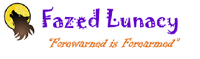

Fazed Lunacy Presentation 
========================================================

<small>Forewarned is Forearmed</small>

author: JHS Developing Data Products student

date: 26-SEP-2015

First Slide
========================================================
title: false
transition: rotate
   

Even before recorded history, the phases of the moon have played a significant role in people's lives.  Full moons in particular instill a feeling of mystery and foreboding.  Some examples from science and folklore:
- Madness - Full moons were believed to instill and heighten madness
- Werewolves - Belief of temporary human transformation into a vicious creature without human cognition or conscience 
- Extreme tides occur at new moon and full moon
- Many cultures based their astrological calendars on lunar

========================================================

   

Fazed Lunacy is a site that predicts the full moon phases based on a mathematical formula calculated using the statistical programming language 'R'.  The use of this site provides several public safety benefits:

- Protect yourself from madmen, werewolves, Celtic astrologers and other "moonbeams from the larger lunacy"
- Know when to take a romantic stroll in the moonlight or when to run away from tidal waves
- Take a holiday to the opposite hemisphere to see the moon upside-down (this provides the additional benefit of stimulating the travel and tourism industries)

========================================================

  

To use Fazed Lunacy, simply select a year and month to see when phases occur.  For the current month, the phases calculate as:
 

====

   

Protect yourself, stimulate the economy or impress your friends and loved ones with your knowledge of lunar events!  Visit the site at the below URL:

[Fazed Lunacy](https://alljoy1.shinyapps.io/PhasedLoonacy)

